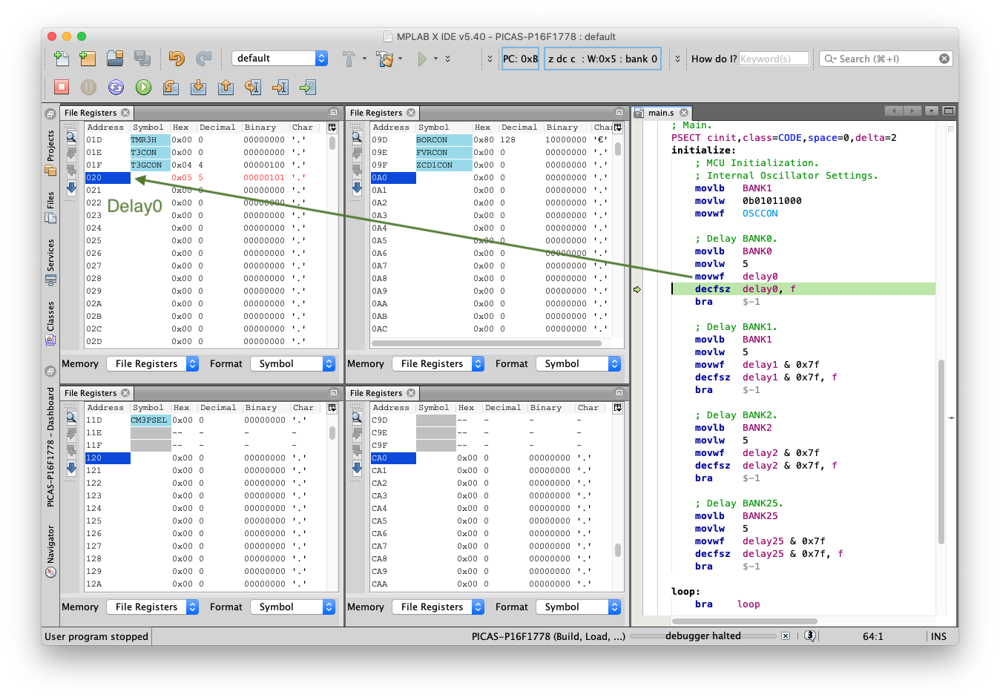
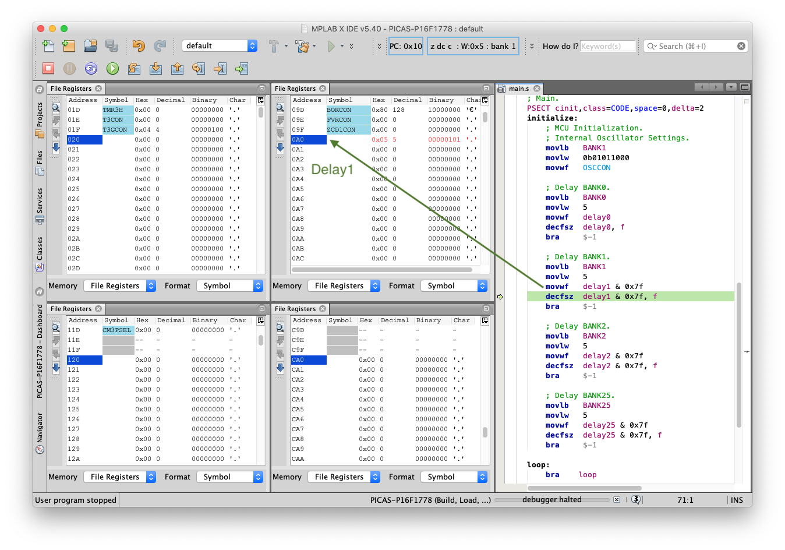
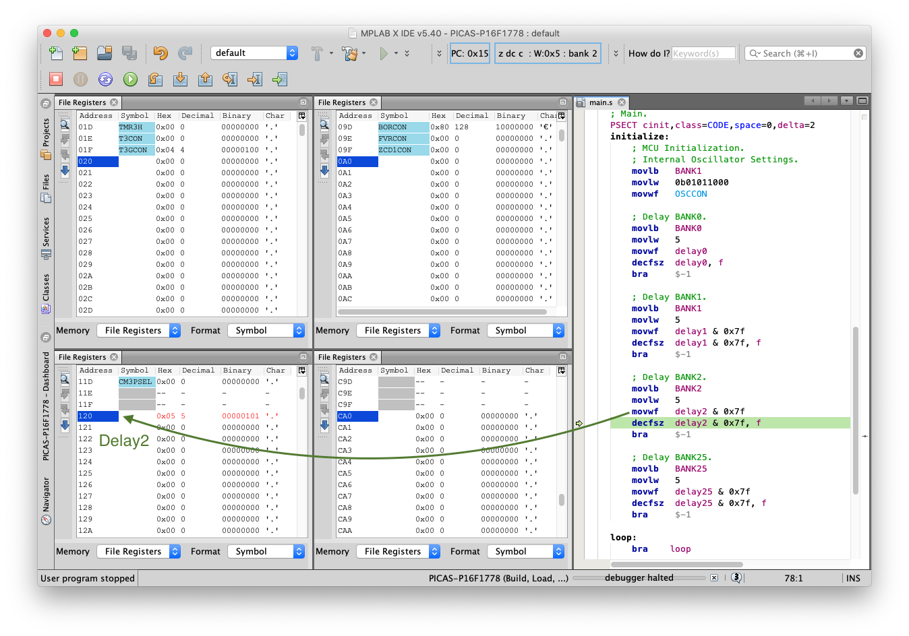
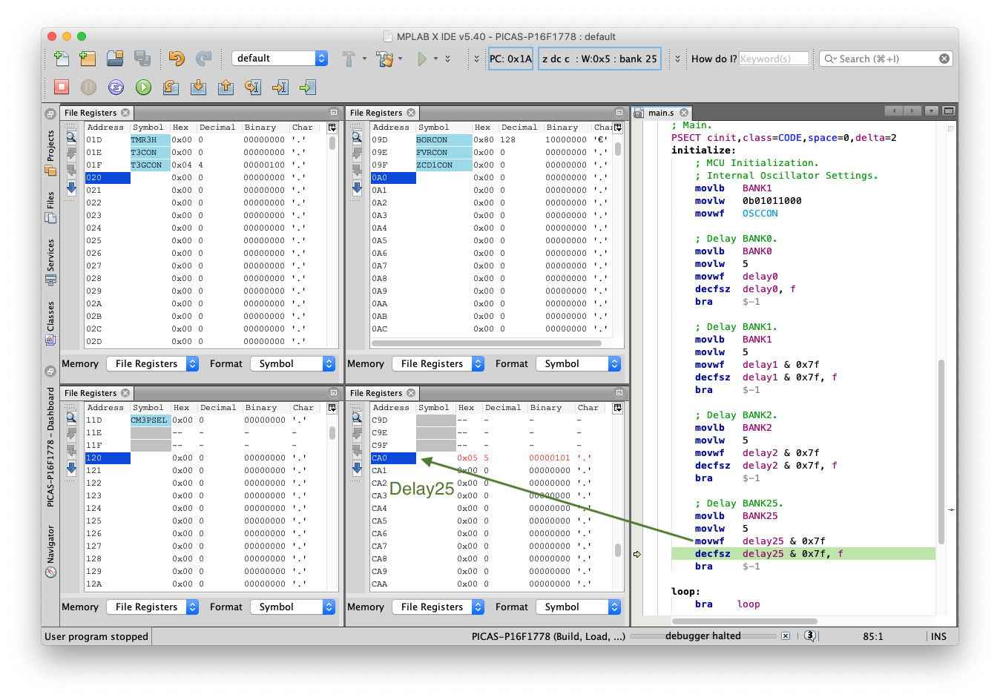
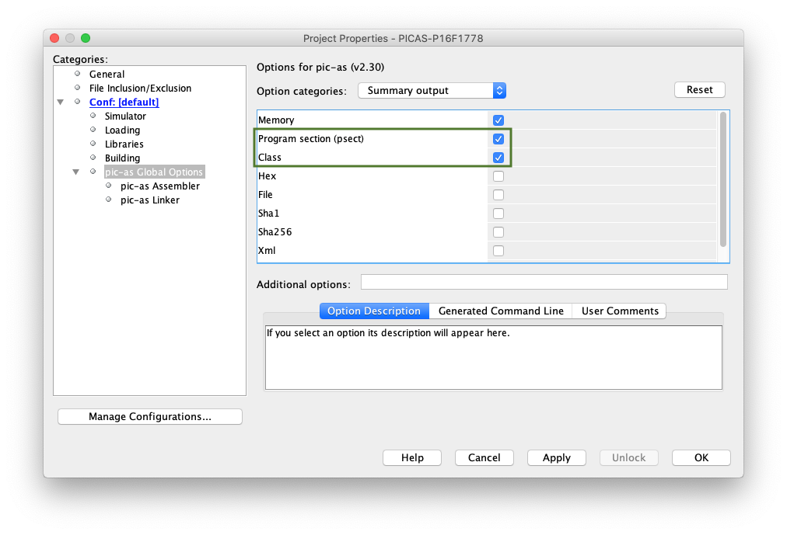
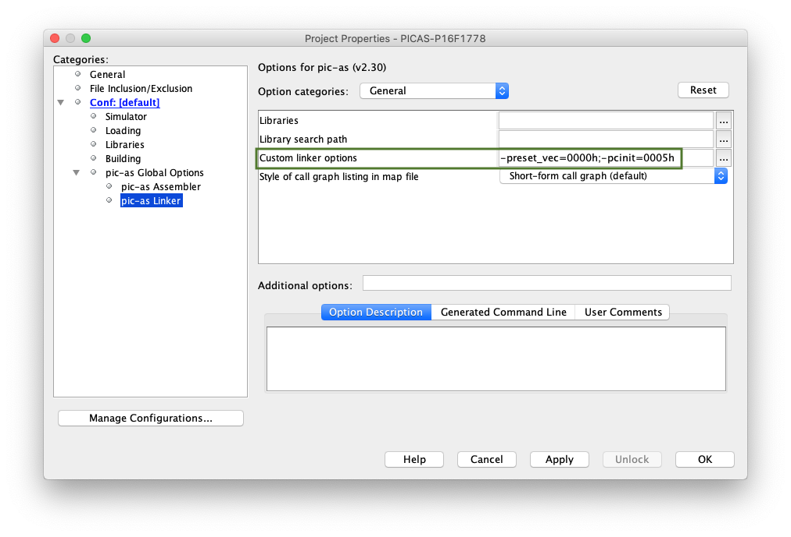

# PIC16F - GPR Bank.

## 0.Contents.

- [1.Code.](#1code)
- [2.Build & Load Output.](#2build--load-output)
- [3.Simulation & Debug.](#3simulation--debug)
- [4.Configuration.](#4configuration)

## 1.Code.

```as
; Configuration Registers.
CONFIG FOSC=INTOSC
CONFIG WDTE=OFF
CONFIG PWRTE=OFF
CONFIG MCLRE=ON
CONFIG CP=OFF
CONFIG BOREN=OFF
CONFIG CLKOUTEN=ON
CONFIG IESO=OFF
CONFIG FCMEN=OFF
CONFIG WRT=OFF
CONFIG PPS1WAY=ON
CONFIG ZCD=OFF
CONFIG PLLEN=OFF
CONFIG STVREN=ON
CONFIG BORV=LO
CONFIG LPBOR=OFF
CONFIG LVP=ON

#include <xc.inc>
; PIC16F1778 - Compile with PIC-AS(v2.32).
; PIC16F1778 - @1MHz Internal Oscillator.

; This is a demonstration code to show how to access the variables present in the different GPR Bank memories.

; GPR BANK0.
PSECT cstackBANK0,class=BANK0,space=1,delta=1
delay0:	    DS  1

; GPR BANK1.
PSECT cstackBANK1,class=BANK1,space=1,delta=1
delay1:	    DS  1

; GPR BANK2.
PSECT cstackBANK2,class=BANK2,space=1,delta=1
delay2:	    DS  1

; GPR BANK25.
PSECT cstackBANK25,class=BANK25,space=1,delta=1
delay25:     DS  1

; MCU Definitions.
; BANKS.
#define	BANK0   0x0
#define	BANK1   0x1
#define	BANK2   0x2
#define	BANK25  0x19

; Reset Vector.
PSECT reset_vec,class=CODE,space=0,delta=2
resetVector:
    goto    initialize

; Main.
PSECT cinit,class=CODE,space=0,delta=2
initialize:
    ; MCU Initialization.
    ; Oscillator Settings.
    movlb   BANK1
    movlw   0b01011000
    movwf   OSCCON

    ; BANK0 Variable delay0.
    movlb   BANK0
    movlw   5
    movwf   delay0
    decfsz  delay0, f
    bra	    $-1

    ; BANK1 Variable delay1.
    movlb   BANK1
    movlw   5
    movwf   delay1 & 0x7f
    decfsz  delay1 & 0x7f, f
    bra	    $-1

    ; BANK2 Variable delay2.
    movlb   BANK2
    movlw   5
    movwf   delay2 & 0x7f
    decfsz  delay2 & 0x7f, f
    bra	    $-1

    ; BANK25 Variable delay25.
    movlb   BANK25
    movlw   5
    movwf   delay25 & 0x7f
    decfsz  delay25 & 0x7f, f
    bra	    $-1

loop:
    bra    $

    END	    resetVector
```

## 2.Build & Load Output.

```diff
Psect Usage Map:

  Psect      | Contents            | Memory Range  | Size
 ------------|---------------------|---------------|------------
  reset_vec  | Reset vector        | 0000h - 0000h |  1 word
  cinit      | Initialization code | 0005h - 001Bh | 17 words
 ------------|---------------------|---------------|------------
             |                     |               |
- cstackBANK | Stack in bank 0     | 0020h - 0020h |  1 byte
             |                     |               |
- cstackBANK | Stack in bank 1     | 00A0h - 00A0h |  1 byte
             |                     |               |
- cstackBANK | Stack in bank 2     | 0120h - 0120h |  1 byte
             |                     |               |
- cstackBANK | Stack in bank 25    | 0CA0h - 0CA0h |  1 byte
 ------------|---------------------|---------------|------------
  config     |                     | 8007h - 8008h |  2 words
 ------------|---------------------|---------------|------------

Memory Class Usage:

Program space:
    CODE                 used    18h (    24) of  4000h words   (  0.1%)
    STRCODE              used     0h (     0) of  4000h words   (  0.0%)
    STRING               used     0h (     0) of  4000h words   (  0.0%)
    CONST                used     0h (     0) of  4000h words   (  0.0%)
    ENTRY                used     0h (     0) of  4000h words   (  0.0%)

Data space:
    COMMON               used     0h (     0) of    10h bytes   (  0.0%)
-    BANK0                used     1h (     1) of    50h bytes   (  1.2%)
-    BANK1                used     1h (     1) of    50h bytes   (  1.2%)
-    BANK2                used     1h (     1) of    50h bytes   (  1.2%)
    BANK3                used     0h (     0) of    50h bytes   (  0.0%)
    BANK4                used     0h (     0) of    50h bytes   (  0.0%)
    BANK5                used     0h (     0) of    50h bytes   (  0.0%)
    BANK6                used     0h (     0) of    50h bytes   (  0.0%)
    BANK7                used     0h (     0) of    50h bytes   (  0.0%)
    BANK8                used     0h (     0) of    50h bytes   (  0.0%)
    BANK9                used     0h (     0) of    50h bytes   (  0.0%)
    BANK10               used     0h (     0) of    50h bytes   (  0.0%)
    BANK11               used     0h (     0) of    50h bytes   (  0.0%)
    BANK12               used     0h (     0) of    30h bytes   (  0.0%)
    BANK13               used     0h (     0) of    50h bytes   (  0.0%)
    BANK14               used     0h (     0) of    50h bytes   (  0.0%)
    BANK15               used     0h (     0) of    50h bytes   (  0.0%)
    BANK16               used     0h (     0) of    50h bytes   (  0.0%)
    BANK17               used     0h (     0) of    50h bytes   (  0.0%)
    BANK18               used     0h (     0) of    50h bytes   (  0.0%)
    BANK19               used     0h (     0) of    50h bytes   (  0.0%)
    BANK20               used     0h (     0) of    50h bytes   (  0.0%)
    BANK21               used     0h (     0) of    50h bytes   (  0.0%)
    BANK22               used     0h (     0) of    50h bytes   (  0.0%)
    BANK23               used     0h (     0) of    50h bytes   (  0.0%)
    BANK24               used     0h (     0) of    50h bytes   (  0.0%)
-   BANK25               used     1h (     1) of    20h bytes   (  3.1%)
    ABS1                 used     0h (     0) of   7E0h bytes   (  0.0%)
```

## 3.Simulation & Debug.

- GPR Bank0: variable **delay0**.

<p align="center"></p>

- GPR Bank1: variable **delay1**.

<p align="center"></p>

- GPR Bank2: variable **delay2**.

<p align="center"></p>

- GPR Bank25: variable **delay25**.

<p align="center"></p>

## 4.Configuration.

- Configure PIC-AS Summary output.

<p align="center"></p>

- Configure PIC-AS Linker Program Sector.

<p align="center"></p>

---
DISCLAIMER: THIS CODE IS PROVIDED WITHOUT ANY WARRANTY OR GUARANTEES.
USERS MAY USE THIS CODE FOR DEVELOPMENT AND EXAMPLE PURPOSES ONLY.
AUTHORS ARE NOT RESPONSIBLE FOR ANY ERRORS, OMISSIONS, OR DAMAGES THAT COULD
RESULT FROM USING THIS FIRMWARE IN WHOLE OR IN PART.
