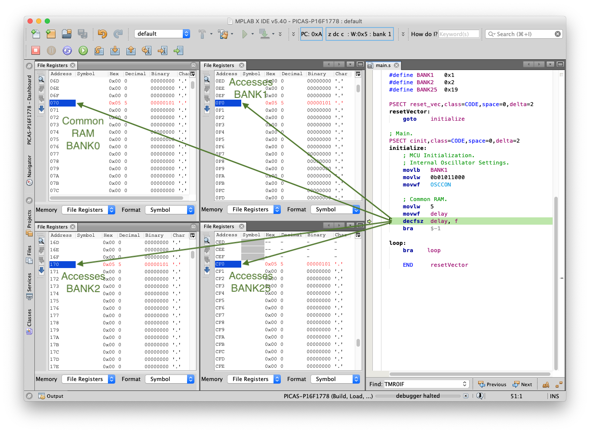

# PIC16F - Common RAM.

## 0.Contents.

- [1.Code.](#1code)
- [2.Build & Load Output.](#2build--load-output)
- [3.Simulation & Debug.](#3simulation--debug)
- [4.Configuration.](#4configuration)

## 1.Code.

```as
; Configuration Registers.
CONFIG FOSC=INTOSC
CONFIG WDTE=OFF
CONFIG PWRTE=OFF
CONFIG MCLRE=ON
CONFIG CP=OFF
CONFIG BOREN=OFF
CONFIG CLKOUTEN=ON
CONFIG IESO=OFF
CONFIG FCMEN=OFF
CONFIG WRT=OFF
CONFIG PPS1WAY=ON
CONFIG ZCD=OFF
CONFIG PLLEN=OFF
CONFIG STVREN=ON
CONFIG BORV=LO
CONFIG LPBOR=OFF
CONFIG LVP=ON

#include <xc.inc>
; PIC16F1778 - Compile with PIC-AS(v2.32).
; PIC16F1778 - @1MHz Internal Oscillator.

; This is a demonstration code to show how to access the variables present in the different Common RAM memories.

; Common RAM.
PSECT cstackCOMM,class=COMMON,space=1,delta=1
delay:	    DS  1

; MCU Definitions.
; BANKS.
#define	BANK1   0x1

; Reset Vector.
PSECT reset_vec,class=CODE,space=0,delta=2
reset_vec:
    goto    initialize

; Main.
PSECT cinit,class=CODE,space=0,delta=2
initialize:
    ; MCU Initialization.
    ; Oscillator Settings.
    movlb   BANK1
    movlw   0b01011000
    movwf   OSCCON

    ; Common RAM.
    movlw   5
    movwf   delay
    decfsz  delay, f
    bra	    $-1

loop:
    bra    $

    END	    reset_vec
```

## 2.Build & Load Output.

```diff
Psect Usage Map:

   Psect      | Contents               | Memory Range  | Size
  ------------|------------------------|---------------|------------
   reset_vec  | Reset vector           | 0000h - 0000h |  1 word   
   cinit      | Initialization code    | 0005h - 001Ch | 18 words  
  ------------|------------------------|---------------|------------
-  cstackCOMM | Stack in common memory | 0070h - 0070h |  1 byte   
  ------------|------------------------|---------------|------------
   config     |                        | 8007h - 8008h |  2 words  
  ------------|------------------------|---------------|------------

Memory Class Usage:

Program space:
    CODE                 used    19h (    25) of  4000h words   (  0.2%)
    STRCODE              used     0h (     0) of  4000h words   (  0.0%)
    STRING               used     0h (     0) of  4000h words   (  0.0%)
    CONST                used     0h (     0) of  4000h words   (  0.0%)
    ENTRY                used     0h (     0) of  4000h words   (  0.0%)

Data space:
-    COMMON               used     1h (     1) of    10h bytes   (  6.2%)
    BANK0                used     0h (     0) of    50h bytes   (  0.0%)
    BANK1                used     0h (     0) of    50h bytes   (  0.0%)
    BANK2                used     0h (     0) of    50h bytes   (  0.0%)
    BANK3                used     0h (     0) of    50h bytes   (  0.0%)
    BANK4                used     0h (     0) of    50h bytes   (  0.0%)
    BANK5                used     0h (     0) of    50h bytes   (  0.0%)
    BANK6                used     0h (     0) of    50h bytes   (  0.0%)
    BANK7                used     0h (     0) of    50h bytes   (  0.0%)
    BANK8                used     0h (     0) of    50h bytes   (  0.0%)
    BANK9                used     0h (     0) of    50h bytes   (  0.0%)
    BANK10               used     0h (     0) of    50h bytes   (  0.0%)
    BANK11               used     0h (     0) of    50h bytes   (  0.0%)
    BANK12               used     0h (     0) of    30h bytes   (  0.0%)
    BANK13               used     0h (     0) of    50h bytes   (  0.0%)
    BANK14               used     0h (     0) of    50h bytes   (  0.0%)
    BANK15               used     0h (     0) of    50h bytes   (  0.0%)
    BANK16               used     0h (     0) of    50h bytes   (  0.0%)
    BANK17               used     0h (     0) of    50h bytes   (  0.0%)
    BANK18               used     0h (     0) of    50h bytes   (  0.0%)
    BANK19               used     0h (     0) of    50h bytes   (  0.0%)
    BANK20               used     0h (     0) of    50h bytes   (  0.0%)
    BANK21               used     0h (     0) of    50h bytes   (  0.0%)
    BANK22               used     0h (     0) of    50h bytes   (  0.0%)
    BANK23               used     0h (     0) of    50h bytes   (  0.0%)
    BANK24               used     0h (     0) of    50h bytes   (  0.0%)
    BANK25               used     0h (     0) of    20h bytes   (  0.0%)
    ABS1                 used     0h (     0) of   7E0h bytes   (  0.0%)
```

## 3.Simulation & Debug.

- Common RAM: variable **delay**.

<p align="center"></p>

## 4.Configuration.

- Configure PIC-AS Summary output.

<p align="center"></p>

- Configure PIC-AS Linker Program Sector.

<p align="center"></p>

---
DISCLAIMER: THIS CODE IS PROVIDED WITHOUT ANY WARRANTY OR GUARANTEES.
USERS MAY USE THIS CODE FOR DEVELOPMENT AND EXAMPLE PURPOSES ONLY.
AUTHORS ARE NOT RESPONSIBLE FOR ANY ERRORS, OMISSIONS, OR DAMAGES THAT COULD
RESULT FROM USING THIS FIRMWARE IN WHOLE OR IN PART.
