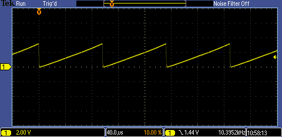

# PIC16F1777/8/9 - 5-Bit Digital-to-Analog Converter (DAC).

## 0.Contents.

- [1.XC8 - PIC16F1778 5-Bit DAC.](https://github.com/tronixio/trainers-pic8bit/blob/main/Features/pic16f177x/dac5.md#1xc8---pic16f1778---5-bit-dac)
- [2.XC8 - PIC16F1777/9 5-Bit DAC.](https://github.com/tronixio/trainers-pic8bit/blob/main/Features/pic16f177x/dac5.md#2xc8---pic16f17779---5-bit-dac)
- [3.PICAS - PIC16F1778 5-Bit DAC.](https://github.com/tronixio/trainers-pic8bit/blob/main/Features/pic16f177x/dac5.md#3picas---pic16f1778---5-bit-dac)
- [4.PICAS - PIC16F1777/9 5-Bit DAC.](https://github.com/tronixio/trainers-pic8bit/blob/main/Features/pic16f177x/dac5.md#4picas---pic16f17779---5-bit-dac)

## 1.XC8 - PIC16F1778 - 5-Bit DAC.

```c
// Configuration Registers.
#pragma config FOSC = INTOSC, WDTE = OFF, PWRTE = OFF, MCLRE = ON, CP = OFF
#pragma config BOREN = OFF, CLKOUTEN = OFF, IESO = OFF, FCMEN = OFF
#pragma config WRT = OFF, PPS1WAY = ON, ZCD = OFF, PLLEN = OFF
#pragma config STVREN = ON, BORV = LO, LPBOR = OFF, LVP = ON

#include <xc.h>
#define _XTAL_FREQ 8000000
// PIC16F1778 - Compile with XC8(v2.36).
// PIC16F1778 - @8MHz Internal Oscillator.

// 5-BIT DAC3/4/7.

// MCU.RB2 -> OSCILLOSCOPE.PROBE.A.

// PIC8-Bit Mini Trainer.
// JUMPER.URX - Not Use.
// JUMPER.UTX - Not Use.
// JUMPER.SDA - Not Use.
// JUMPER.SCL - Not Use.
// JUMPER.VCAP - Not Use.
// JUMPER.BCKL - Not Use.

// PIC8-Bit Trainer.
// JUMPER.SDA - Not Use.
// JUMPER.SCL - Not Use.
// JUMPER.VEE - Not Use.
// JUMPER.BCKL - Not Use.
// JUMPER.VCAP - Not Use.
// JUMPER.SPI/I2C - Not Use.

// Main.
void main(void)
{
    // MCU Initialization.
    // Oscillator Settings.
    OSCTUNE = 0b00000000;
    OSCCON = 0x70;
    while(!OSCSTATbits.HFIOFR){};
    // Ports Settings.
    // PORT Data Register.
    PORTA = 0b00000000;
    PORTB = 0b00000000;
    PORTC = 0b00000000;
    // TRIS Data Direction.
    TRISA = 0b00000000;
    TRISB = 0b00000000;
    TRISC = 0b00000000;
    // WPU Disable.
    OPTION_REGbits.nWPUEN = 0b1;
    // LATCH Outputs.
    LATA = 0b00000000;
    LATB = 0b00000000;
    LATC = 0b00000000;
    // ANSEL Analog.
    ANSELA = 0b00000000;
    ANSELB = 0b00000000;
    ANSELC = 0b00000000;
    // WPU Weak Pull-up.
    WPUA = 0b00000000;
    WPUB = 0b00000000;
    WPUC = 0b00000000;
    // ODCON Open-drain.
    ODCONA = 0b00000000;
    ODCONB = 0b00000000;
    ODCONC = 0b00000000;
    // SRLCON Slew Rate.
    SLRCONA = 0b11111111;
    SLRCONB = 0b11111111;
    SLRCONC = 0b11111111;
    // INLVL Input Level.
    INLVLA = 0b00000000;
    INLVLB = 0b00000000;
    INLVLC = 0b00000000;
    // HIDRVB High Drive.
    HIDRVB = 0b00000000;

    // DAC3/4/7 - Control.
    // OE1 - Voltage Output Enable.
    // OE1.0 = 1 - Enable Voltage Level Output DACxOUT1 Pin.
    // OE1.0 = 0 - Disable Voltage Level Output DACxOUT1 Pin.
    DAC3CON0bits.OE1 = 0b1;
    // OE2 - Voltage Output Enable.
    // OE2.0 = 1 - Enable Voltage Level Output DACxOUT2 Pin.
    // OE2.0 = 0 - Disable Voltage Level Output DACxOUT2 Pin.
    DAC3CON0bits.OE2 = 0b0;
    // PSS - Positive Source.
    // PSS1.0 = 1 0 = FVR Buffer2 Output.
    // PSS1.0 = 0 1 - VREF+ Pin.
    // PSS1.0 = 0 0 - VDD.
    DAC3CON0bits.PSS = 0b00;
    // NSS - Negative Source.
    // NSS1.0 = 0 1 - DACxREF0-.
    // NSS1.0 = 0 0 - AVSS.
    DAC3CON0bits.NSS = 0b00;
    // DACxR - Reference Voltage Output.
    // DAC Vout = VDD / 32.
    // DAC3R4.0 = 1 1 1 1 1 - 3V18.
    // DAC3R4.0 = 1 1 1 1 0 - 3V08.
    // DAC3R4.0 = ...
    // DAC3R4.0 =  0 0 0 0 1 - 0V10.
    // DAC3R4.0 =  0 0 0 0 0 - 0V.
    DAC3REFbits.DAC3R = 0b00000;
    // DAC3/4/7 Enable.
    DAC3CON0bits.EN = 0b1;

    while(1){
        DAC3REF++;
    }
}
```
- DAC3 Output.

<p align="center"></p>

## 2.XC8 - PIC16F1777/9 - 5-Bit DAC.

```c
// Configuration Registers.
#pragma config FOSC = INTOSC, WDTE = OFF, PWRTE = OFF, MCLRE = ON, CP = OFF
#pragma config BOREN = OFF, CLKOUTEN = OFF, IESO = OFF, FCMEN = OFF
#pragma config WRT = OFF, PPS1WAY = ON, ZCD = OFF, PLLEN = OFF
#pragma config STVREN = ON, BORV = LO, LPBOR = OFF, LVP = ON

#include <xc.h>
#define _XTAL_FREQ 8000000
// PIC16F1778 - Compile with XC8(v2.36).
// PIC16F1778 - @8MHz Internal Oscillator.

// 5-BIT DAC3/4/7/8.

// MCU.RB2 -> OSCILLOSCOPE.PROBE.A.

// PIC8-Bit Mini Trainer.
// JUMPER.URX - Open.
// JUMPER.UTX - Open.
// JUMPER.SDA - Open.
// JUMPER.SCL - Open.
// JUMPER.VCAP - Open.
// JUMPER.BCKL - Open.

// PIC8-Bit Trainer.
// JUMPER.SDA - Open.
// JUMPER.SCL - Open.
// JUMPER.VEE - Open.
// JUMPER.BCKL - Open.
// JUMPER.VCAP - Open.
// JUMPER.SPI/I2C - Open.

// Main.
void main(void)
{
    // MCU Initialization.
    // Oscillator Settings.
    OSCTUNE = 0b00000000;
    OSCCON = 0x70;
    while(!OSCSTATbits.HFIOFR){};
    // Ports Settings.
    // PORT Data Register.
    PORTA = 0b00000000;
    PORTB = 0b00000000;
    PORTC = 0b00000000;
    PORTD = 0b00000000;
    PORTE = 0b00000000;
    // TRIS Data Direction.
    TRISA = 0b00000000;
    TRISB = 0b00000000;
    TRISD = 0b00000000;
    TRISE = 0b00001000;
    // WPU Disable.
    OPTION_REGbits.nWPUEN = 0b1;
    // LATCH Outputs.
    LATA = 0b00000000;
    LATB = 0b00000000;
    LATC = 0b00000000;
    LATD = 0b00000000;
    LATE = 0b00000000;
    // ANSEL Analog.
    ANSELA = 0b00000000;
    ANSELB = 0b00000000;
    ANSELC = 0b00000000;
    ANSELD = 0b00000000;
    ANSELE = 0b00000000;
    // WPU Weak Pull-up.
    WPUA = 0b00000000;
    WPUB = 0b00000000;
    WPUC = 0b00000000;
    WPUD = 0b00000000;
    WPUE = 0b00000000;
    // ODCON Open-drain.
    ODCONA = 0b00000000;
    ODCONB = 0b00000000;
    ODCONC = 0b00000000;
    ODCOND = 0b00000000;
    ODCONE = 0b00000000;
    // SRLCON Slew Rate.
    SLRCONA = 0b11111111;
    SLRCONB = 0b11111111;
    SLRCONC = 0b11111111;
    SLRCOND = 0b11111111;
    SLRCONE = 0b11111111;
    // INLVL Input Level.
    INLVLA = 0b00000000;
    INLVLB = 0b00000000;
    INLVLC = 0b00000000;
    INLVLD = 0b00000000;
    // HIDRVB High Drive.
    HIDRVB = 0b00000000;

    // DAC3/4/7 - Control.
    // OE1 - Voltage Output Enable.
    // OE1.0 = 1 - Enable Voltage Level Output DACxOUT1 Pin.
    // OE1.0 = 0 - Disable Voltage Level Output DACxOUT1 Pin.
    DAC3CON0bits.OE1 = 0b1;
    // OE2 - Voltage Output Enable.
    // OE2.0 = 1 - Enable Voltage Level Output DACxOUT2 Pin.
    // OE2.0 = 0 - Disable Voltage Level Output DACxOUT2 Pin.
    DAC3CON0bits.OE2 = 0b0;
    // PSS - Positive Source.
    // PSS1.0 = 1 0 = FVR Buffer2 Output.
    // PSS1.0 = 0 1 - VREF+ Pin.
    // PSS1.0 = 0 0 - VDD.
    DAC3CON0bits.PSS = 0b00;
    // NSS - Negative Source.
    // NSS1.0 = 0 1 - DACxREF0-.
    // NSS1.0 = 0 0 - AVSS.
    DAC3CON0bits.NSS = 0b00;
    // DACxR - Reference Voltage Output.
    // DAC Vout = VDD / 32.
    // DAC3R4.0 = 1 1 1 1 1 - 3V18.
    // DAC3R4.0 = 1 1 1 1 0 - 3V08.
    // DAC3R4.0 = ...
    // DAC3R4.0 = 0 0 0 0 1 - 0V10.
    // DAC3R4.0 = 0 0 0 0 0 - 0V.
    DAC3REFbits.DAC3R = 0b00000;
    // DAC3/4/7 Enable.
    DAC3CON0bits.EN = 0b1;
    // DAC3/4/7 - Control.
    // OE1 - Voltage Output Enable.
    // OE1.0 = 1 - Enable Voltage Level Output DACxOUT1 Pin.
    // OE1.0 = 0 - Disable Voltage Level Output DACxOUT1 Pin.
    DAC3CON0bits.OE1 = 0b1;
    // OE2 - Voltage Output Enable.
    // OE2.0 = 1 - Enable Voltage Level Output DACxOUT2 Pin.
    // OE2.0 = 0 - Disable Voltage Level Output DACxOUT2 Pin.
    DAC3CON0bits.OE2 = 0b0;
    // PSS - Positive Source.
    // PSS1.0 = 1 0 = FVR Buffer2 Output.
    // PSS1.0 = 0 1 - VREF+ Pin.
    // PSS1.0 = 0 0 - VDD.
    DAC3CON0bits.PSS = 0b00;
    // NSS - Negative Source.
    // NSS1.0 = 0 1 - DACxREF0-.
    // NSS1.0 = 0 0 - AVSS.
    DAC3CON0bits.NSS = 0b00;
    // DACxR - Reference Voltage Output.
    // DAC Vout = VDD / 32.
    // DAC3R4.0 = 1 1 1 1 1 - 3V18.
    // DAC3R4.0 =  - 3V08.
    // DAC3R4.0 = ...
    // DAC3R4.0 =  - 0V10.
    // DAC3R4.0 =  - 0V.
    DAC3REFbits.DAC3R = 0b00000;
    // DAC3/4/7 Enable.
    DAC3CON0bits.EN = 0b1;

    while(1){
        DAC3REF++;
    }
}
```

- DAC3 Output.

<p align="center"></p>

## 3.PICAS - PIC16F1778 - 5-Bit DAC.

```as
; Configuration Registers.
CONFIG FOSC=INTOSC
CONFIG WDTE=OFF
CONFIG PWRTE=OFF
CONFIG MCLRE=ON
CONFIG CP=OFF
CONFIG BOREN=OFF
CONFIG CLKOUTEN=OFF
CONFIG IESO=OFF
CONFIG FCMEN=OFF
CONFIG WRT=OFF
CONFIG PPS1WAY=ON
CONFIG ZCD=OFF
CONFIG PLLEN=OFF
CONFIG STVREN=ON
CONFIG BORV=LO
CONFIG LPBOR=OFF
CONFIG LVP=ON

#include <xc.inc>
; PIC16F1778 - Compile with PIC-AS(v2.36).
; PIC16F1778 - @8MHz Internal Oscillator.
; Custom linker options: -preset_vec=0000h, -pcinit=0005h.

; 5-BIT DAC3/4/7.

; MCU.RB2 -> OSCILLOSCOPE.PROBE.A.

; PIC8-Bit Mini Trainer.
; JUMPER.URX - Not Use.
; JUMPER.UTX - Not Use.
; JUMPER.SDA - Not Use.
; JUMPER.SCL - Not Use.
; JUMPER.VCAP - Not Use.
; JUMPER.BCKL - Not Use.

; PIC8-Bit Trainer.
; JUMPER.SDA - Not Use.
; JUMPER.SCL - Not Use.
; JUMPER.VEE - Not Use.
; JUMPER.BCKL - Not Use.
; JUMPER.VCAP - Not Use.
; JUMPER.SPI/I2C - Not Use.

; MCU Definitions.
; BANKS.
#define	BANK0   0x0
#define	BANK1   0x1
#define	BANK2   0x2
#define	BANK3   0x3
#define	BANK4   0x4
#define	BANK5   0x5
#define	BANK6   0x6
#define	BANK7   0x7
#define	BANK8   0x8
#define	BANK9   0x9
#define	BANK10	0xA
#define	BANK11	0xB
#define	BANK12	0xC
#define	BANK13	0xD
#define	BANK14	0xE
#define	BANK15	0xF
#define	BANK16	0x10
#define	BANK17	0x11
#define	BANK18	0x12
#define	BANK19	0x13
#define	BANK20	0x14
#define	BANK21	0x15
#define	BANK22	0x16
#define	BANK23	0x17
#define	BANK24	0x18
#define	BANK25  0x19
#define	BANK26  0x1A
#define	BANK27  0x1B
#define	BANK28  0x1C
#define	BANK29  0x1D

; Reset Vector.
PSECT reset_vec,class=CODE,space=0,delta=2
reset_vec:
    BRA    initialize

; Main.
PSECT cinit,global,class=CODE,space=0,merge=1,delta=2
initialize:
    ; MCU Initialization.
    ; Internal Oscillator.
    MOVLB   BANK1
    MOVLW   0b00000000
    MOVWF   OSCTUNE
    MOVLW   0x70
    MOVWF   OSCCON
    BTFSS   OSCSTAT, 0x4
    BRA	    $-1
    ; Ports Settings.
    ; PORT Data Register.
    MOVLB   BANK0
    MOVLW   0b00000000
    MOVWF   PORTA
    MOVLW   0b00000000
    MOVWF   PORTB
    MOVLW   0b00000000
    MOVWF   PORTC
    ; TRIS Data Direction.
    MOVLB   BANK1
    MOVLW   0b00000000
    MOVWF   TRISA
    MOVLW   0b00000000
    MOVWF   TRISB
    MOVLW   0b00000000
    MOVWF   TRISC
    ; WPU Disable.
    BSF	    nWPUEN
    ; LATCH Outputs.
    MOVLB   BANK2
    MOVLW   0b00000000
    MOVWF   LATA
    MOVLW   0b00000000
    MOVWF   LATB
    MOVLW   0b00000000
    MOVWF   LATC
    ; ANSEL Analog.
    MOVLB   BANK3
    MOVLW   0b00000000
    MOVWF   ANSELA
    MOVLW   0b00000000
    MOVWF   ANSELB
    MOVLW   0b00000000
    MOVWF   ANSELC
    ; WPU Weak Pull-up.
    MOVLB   BANK4
    MOVLW   0b00000000
    MOVWF   WPUA
    MOVLW   0b00000000
    MOVWF   WPUB
    MOVLW   0b00000000
    MOVWF   WPUC
    ; ODCON Open-drain.
    MOVLB   BANK5
    MOVLW   0b00000000
    MOVWF   ODCONA
    MOVLW   0b00000000
    MOVWF   ODCONB
    MOVLW   0b00000000
    MOVWF   ODCONC
    ; SRLCON Slew Rate.
    MOVLB   BANK6
    MOVLW   0b11111111
    MOVWF   SLRCONA
    MOVLW   0b11111111
    MOVWF   SLRCONB
    MOVLW   0b11111111
    MOVWF   SLRCONC
    ; INLVL Input Level.
    MOVLB   BANK7
    MOVLW   0b00000000
    MOVWF   INLVLA
    MOVLW   0b00000000
    MOVWF   INLVLB
    MOVLW   0b00000000
    MOVWF   INLVLC
    ; HIDRVB High Drive.
    MOVLB   BANK8
    CLRF    HIDRVB

    ; DACx Setting.
    MOVLB   BANK11
    MOVLW   0b00100000
    MOVWF   DAC3CON0
    MOVLW   0b00000000
    MOVWF   DAC3REF
    ; DACx Enable.
    BSF	    DAC3CON0, 0x7

loop:
    INCF    DAC3REF, F
    BRA	    $-1

    END	    reset_vec
```

- DAC3 Output.

<p align="center"></p>

## 4.PICAS - PIC16F1777/9 - 5-Bit DAC.

```as
; Configuration Registers.
CONFIG FOSC=INTOSC
CONFIG WDTE=OFF
CONFIG PWRTE=OFF
CONFIG MCLRE=ON
CONFIG CP=OFF
CONFIG BOREN=OFF
CONFIG CLKOUTEN=OFF
CONFIG IESO=OFF
CONFIG FCMEN=OFF
CONFIG WRT=OFF
CONFIG PPS1WAY=ON
CONFIG ZCD=OFF
CONFIG PLLEN=OFF
CONFIG STVREN=ON
CONFIG BORV=LO
CONFIG LPBOR=OFF
CONFIG LVP=ON

#include <xc.inc>
; PIC16F1777/9 - Compile with PIC-AS(v2.36).
; PIC16F1777/9 - @8MHz Internal Oscillator.
; Custom linker options: -preset_vec=0000h, -pcinit=0005h.

; 5-BIT DAC3/4/7/8.

; MCU.RB2 -> OSCILLOSCOPE.PROBE.A.

; PIC8-Bit Nano Trainer.
; JUMPER.SDA - Not Use.
; JUMPER.SCL - Not Use.

; MCU Definitions.
; BANKS.
#define	BANK0   0x0
#define	BANK1   0x1
#define	BANK2   0x2
#define	BANK3   0x3
#define	BANK4   0x4
#define	BANK5   0x5
#define	BANK6   0x6
#define	BANK7   0x7
#define	BANK8   0x8
#define	BANK9   0x9
#define	BANK10	0xA
#define	BANK11	0xB
#define	BANK12	0xC
#define	BANK13	0xD
#define	BANK14	0xE
#define	BANK15	0xF
#define	BANK16	0x10
#define	BANK17	0x11
#define	BANK18	0x12
#define	BANK19	0x13
#define	BANK20	0x14
#define	BANK21	0x15
#define	BANK22	0x16
#define	BANK23	0x17
#define	BANK24	0x18
#define	BANK25  0x19
#define	BANK26  0x1A
#define	BANK27  0x1B
#define	BANK28  0x1C
#define	BANK29  0x1D

; Reset Vector.
PSECT reset_vec,class=CODE,space=0,delta=2
reset_vec:
    BRA    initialize

; Main.
PSECT cinit,global,class=CODE,space=0,merge=1,delta=2
initialize:
    ; MCU Initialization.
    ; Internal Oscillator.
    MOVLB   BANK1
    MOVLW   0b00000000
    MOVWF   OSCTUNE
    MOVLW   0x70
    MOVWF   OSCCON
    BTFSS   OSCSTAT, 0x4
    BRA	    $-1
    ; Ports Settings.
    ; PORT Data Register.
    MOVLB   BANK0
    MOVLW   0b00000000
    MOVWF   PORTA
    MOVLW   0b00000000
    MOVWF   PORTB
    MOVLW   0b00000000
    MOVWF   PORTC
    MOVLW   0b00000000
    MOVWF   PORTD
    MOVLW   0b00000000
    MOVWF   PORTE
    ; TRIS Data Direction.
    MOVLB   BANK1
    MOVLW   0b00000000
    MOVWF   TRISA
    MOVLW   0b00000000
    MOVWF   TRISB
    MOVLW   0b00000000
    MOVWF   TRISC
    MOVLW   0b00000000
    MOVWF   TRISD
    MOVLW   0b00001000
    MOVWF   TRISE
    ; WPU Disable.
    BSF	    nWPUEN
    ; LATCH Outputs.
    MOVLB   BANK2
    MOVLW   0b00000000
    MOVWF   LATA
    MOVLW   0b00000000
    MOVWF   LATB
    MOVLW   0b00000000
    MOVWF   LATC
    MOVLW   0b00000000
    MOVWF   LATD
    MOVLW   0b00000000
    MOVWF   LATE
    ; ANSEL Analog.
    MOVLB   BANK3
    MOVLW   0b00000000
    MOVWF   ANSELA
    MOVLW   0b00000000
    MOVWF   ANSELB
    MOVLW   0b00000000
    MOVWF   ANSELC
    MOVLW   0b00000000
    MOVWF   ANSELD
    MOVLW   0b00000000
    MOVWF   ANSELE
    ; WPU Weak Pull-up.
    MOVLB   BANK4
    MOVLW   0b00000000
    MOVWF   WPUA
    MOVLW   0b00000000
    MOVWF   WPUB
    MOVLW   0b00000000
    MOVWF   WPUC
    MOVLW   0b00000000
    MOVWF   WPUD
    MOVLW   0b00000000
    MOVWF   WPUE
    ; ODCON Open-drain.
    MOVLB   BANK5
    MOVLW   0b00000000
    MOVWF   ODCONA
    MOVLW   0b00000000
    MOVWF   ODCONB
    MOVLW   0b00000000
    MOVWF   ODCONC
    MOVLW   0b00000000
    MOVWF   ODCOND
    MOVLW   0b00000000
    MOVWF   ODCONE
    ; SRLCON Slew Rate.
    MOVLB   BANK6
    MOVLW   0b11111111
    MOVWF   SLRCONA
    MOVLW   0b11111111
    MOVWF   SLRCONB
    MOVLW   0b11111111
    MOVWF   SLRCONC
    MOVLW   0b11111111
    MOVWF   SLRCOND
    MOVLW   0b11111111
    MOVWF   SLRCONE
    ; INLVL Input Level.
    MOVLB   BANK7
    MOVLW   0b00000000
    MOVWF   INLVLA
    MOVLW   0b00000000
    MOVWF   INLVLB
    MOVLW   0b00000000
    MOVWF   INLVLC
    MOVLW   0b00000000
    MOVWF   INLVLD
    ; HIDRVB High Drive.
    MOVLB   BANK8
    CLRF    HIDRVB

    ; DACx Setting.
    MOVLB   BANK11
    MOVLW   0b00100000
    MOVWF   DAC3CON0
    MOVLW   0b00000000
    MOVWF   DAC3REF
    ; DACx Enable.
    BSF	    DAC3EN

loop:
    INCF    DAC3REF, F
    BRA	    $-1

    END	    reset_vec
```

- DAC3 Output.

<p align="center"></p>

---
DISCLAIMER: THIS CODE IS PROVIDED WITHOUT ANY WARRANTY OR GUARANTEES.
USERS MAY USE THIS CODE FOR DEVELOPMENT AND EXAMPLE PURPOSES ONLY.
AUTHORS ARE NOT RESPONSIBLE FOR ANY ERRORS, OMISSIONS, OR DAMAGES THAT COULD
RESULT FROM USING THIS FIRMWARE IN WHOLE OR IN PART.
