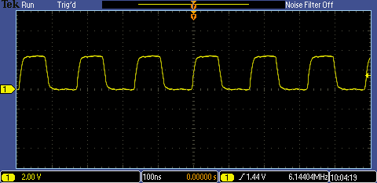

# PIC16F1777/8/9 - External Oscillator.

## 0.Contents.

- [1.ECH - External Clock High-Power.](https://github.com/tronixio/trainers-pic8bit/blob/main/Features/pic16f177x/extosc.md#1ech---external-clock-high-power)

## 1.ECH - External Clock High-Power.

```c
// Configuration Registers.
#pragma config FOSC = ECH, WDTE = OFF, PWRTE = OFF, MCLRE = ON, CP = OFF
#pragma config BOREN = OFF, CLKOUTEN = ON, IESO = OFF, FCMEN = ON
#pragma config WRT = OFF, PPS1WAY = ON, ZCD = OFF, PLLEN = OFF
#pragma config STVREN = ON, BORV = LO, LPBOR = OFF, LVP = ON

#include <xc.h>
// PIC16F1777/8/9 - Compile with XC8(v2.36).
// PIC16F1777/8/9 - @24.5760MHz External Oscillator.

// ECH External Oscillator.

// MCU.RA6 -> OSCILLOSCOPE.PROBE.A.

// PIC8-Bit Nano Trainer with MEMS DSC1001CI2-024.5760.
// JUMPER.SDA - Not Use.
// JUMPER.SCL - Not Use.

// Main.
void main(void)
{
    // MCU Initialization.
    // Oscillator Settings.
    // SPLLEN - Software PLL.
    // SPLLEN.0 = 1 - Enable PLL.
    // SPLLEN.0 = 0 - Disable PLL.
    OSCCONbits.SPLLEN= 0b0;
    // SCS - System Clock.
    // SCS1.0 = 1 x - Internal Oscillator.
    // SCS1.0 = 0 1 - Secondary Oscillator.
    // SCS1.0 = 0 0 - FOSC2.0 Configuration Words Oscillator.
    OSCCONbits.SCS = 0b00;

    while(1){
    }
}
```

- FOSC=24.576MHz, SPLLEN=0.

<p align="center"></p>

---
DISCLAIMER: THIS CODE IS PROVIDED WITHOUT ANY WARRANTY OR GUARANTEES.
USERS MAY USE THIS CODE FOR DEVELOPMENT AND EXAMPLE PURPOSES ONLY.
AUTHORS ARE NOT RESPONSIBLE FOR ANY ERRORS, OMISSIONS, OR DAMAGES THAT COULD
RESULT FROM USING THIS FIRMWARE IN WHOLE OR IN PART.
