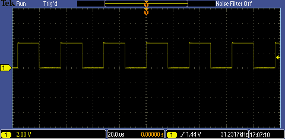
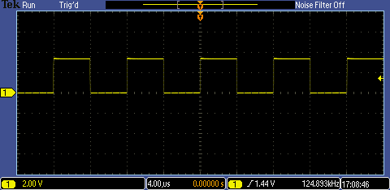
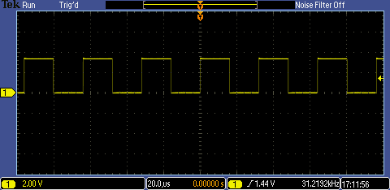
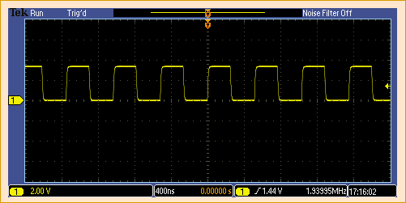
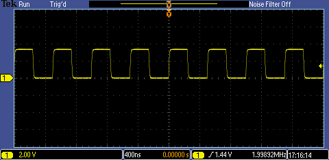
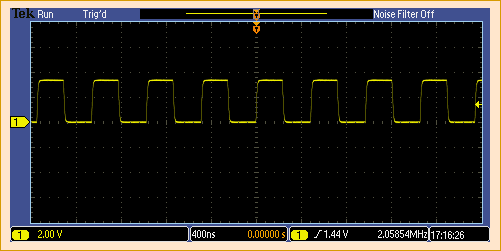

# PIC16F1777/8/9 - Internal Oscillator.

## 0.Contents.

- [1.LFINTOSC - Low-Frequency Internal Oscillator.](https://github.com/tronixio/trainers-pic8bit/blob/main/Features/pic16f177x/intosc.md#1lfintosc---low-frequency-internal-oscillator)
- [2.MFINTOSC - Medium-Frequency Internal Oscillator.](https://github.com/tronixio/trainers-pic8bit/blob/main/Features/pic16f177x/intosc.md#2mfintosc---medium-frequency-internal-oscillator)
- [3.HFINTOSC - High-Frequency Internal Oscillator.](https://github.com/tronixio/trainers-pic8bit/blob/main/Features/pic16f177x/intosc.md#3hfintosc---high-frequency-internal-oscillator)
- [4.HFINTOSC - High-Frequency Internal Oscillator with **PLL**.](https://github.com/tronixio/trainers-pic8bit/blob/main/Features/pic16f177x/intosc.md#4hfintosc---high-frequency-internal-oscillator-with-pll)

## 1.LFINTOSC - Low-Frequency Internal Oscillator.

```c
// Configuration Registers.
#pragma config FOSC = INTOSC, WDTE = OFF, PWRTE = OFF, MCLRE = ON, CP = OFF
#pragma config BOREN = OFF, CLKOUTEN = ON, IESO = OFF, FCMEN = ON
#pragma config WRT = OFF, PPS1WAY = ON, ZCD = OFF, PLLEN = OFF
#pragma config STVREN = ON, BORV = LO, LPBOR = OFF, LVP = ON

#include <xc.h>
// PIC16F1777/8/9 - Compile with XC8(v2.36).
// PIC16F1777/8/9 - @xMHz Internal Oscillator.

// LF Low-Frequency Internal Oscillator.

// MCU.RA6 -> OSCILLOSCOPE.PROBE.A.

// PIC8-Bit Nano Trainer.
// JUMPER.SDA - Not Use.
// JUMPER.SCL - Not Use.

// PIC8-Bit Mini Trainer.
// JUMPER.URX - Not Use.
// JUMPER.UTX - Not Use.
// JUMPER.SDA - Not Use.
// JUMPER.SCL - Not Use.
// JUMPER.VCAP - Not Use.
// JUMPER.BCKL - Not Use.

// PIC8-Bit Trainer.
// JUMPER.SDA - Not Use.
// JUMPER.SCL - Not Use.
// JUMPER.VEE - Not Use.
// JUMPER.BCKL - Not Use.
// JUMPER.VCAP - Not Use.
// JUMPER.SPI/I2C - Not Use.

// Main.
void main(void)
{
    // MCU Initialization.
    // Oscillator Settings.
    // IRCF - Internal Oscillator Frequency.
    // IRCF3.0 = 0 0 0 x - LF 31kHz.
    OSCCONbits.IRCF = 0b0000;
    // SCS - System Clock.
    // SCS1.0 = 1 x - Internal Oscillator.
    // SCS1.0 = 0 1 - Secondary Oscillator.
    // SCS1.0 = 0 0 - FOSC2.0 Configuration Words Oscillator.
    OSCCONbits.SCS = 0b00;
    // Wait Internal Low-Frequency Oscillator Ready.
    while(!OSCSTATbits.LFIOFR){};

    while(1){
    }
}
```

- FOSC=31kHz, IRCF=0000.

<p align="center"></p>

## 2.MFINTOSC - Medium-Frequency Internal Oscillator.

```c
// Configuration Registers.
#pragma config FOSC = INTOSC, WDTE = OFF, PWRTE = OFF, MCLRE = ON, CP = OFF
#pragma config BOREN = OFF, CLKOUTEN = ON, IESO = OFF, FCMEN = OFF
#pragma config WRT = OFF, PPS1WAY = ON, ZCD = OFF, PLLEN = OFF
#pragma config STVREN = ON, BORV = LO, LPBOR = OFF, LVP = ON

#include <xc.h>
// PIC16F1777/8/9 - Compile with XC8(v2.36).
// PIC16F1777/8/9 - @xMHz Internal Oscillator.

// MF Medium-Frequency Internal Oscillator.

// MCU.RA6 -> OSCILLOSCOPE.PROBE.A.

// PIC8-Bit Nano Trainer.
// JUMPER.SDA - Not Use.
// JUMPER.SCL - Not Use.

// PIC8-Bit Mini Trainer.
// JUMPER.URX - Not Use.
// JUMPER.UTX - Not Use.
// JUMPER.SDA - Not Use.
// JUMPER.SCL - Not Use.
// JUMPER.VCAP - Not Use.
// JUMPER.BCKL - Not Use.

// PIC8-Bit Trainer.
// JUMPER.SDA - Not Use.
// JUMPER.SCL - Not Use.
// JUMPER.VEE - Not Use.
// JUMPER.BCKL - Not Use.
// JUMPER.VCAP - Not Use.
// JUMPER.SPI/I2C - Not Use.

// Main.
void main(void)
{
    // MCU Initialization.
    // Oscillator Settings.
    // OSCTUNE - Oscillator Tuning.
    // OSCTUNE5.0 = 0 1 1 1 1 1 - Maximum Frequency.
    //...
    // OSCTUNE5.0 = 0 0 0 0 0 0 - Factory Calibrated Frequency.
    // ...
    // OSCTUNE5.0 = 1 0 0 0 0 0 - Minimum Frequency.
    OSCTUNEbits.TUN = 0b00000;
    // IRCF - Internal Oscillator Frequency.
    // IRCF3.0 = 0 1 1 1 - MF 500kHz.
    // IRCF3.0 = 0 1 1 0 - MF 250kHz.
    // IRCF3.0 = 0 1 0 1 - MF 125kHz.
    // IRCF3.0 = 0 1 0 0 - MF 62.5kHz.
    // IRCF3.0 = 0 0 1 0 - MF 31.25kHz.
    OSCCONbits.IRCF = 0b0010;
    // SCS - System Clock.
    // SCS1.0 = 1 x - Internal Oscillator.
    // SCS1.0 = 0 1 - Secondary Oscillator.
    // SCS1.0 = 0 0 - FOSC2.0 Configuration Words Oscillator.
    OSCCONbits.SCS = 0b00;
    // Wait Internal Medium-Frequency Oscillator Ready.
    while(!OSCSTATbits.MFIOFR){};

    while(1){
    }
}
```

- FOSC=31.25kHz, IRCF=0010, TUN=000000.

<p align="center"></p>

- FOSC=62.5kHz, IRCF=0100, TUN=000000.

<p align="center"></p>

- FOSC=125kHz, IRCF=0101, TUN=000000.

<p align="center"></p>

- FOSC=250kHz, IRCF=0110, TUN=000000.

<p align="center"></p>

- FOSC=500kHz, IRCF=0111, TUN=000000.

<p align="center"></p>

## 3.HFINTOSC - High-Frequency Internal Oscillator.

```c
// Configuration Registers.
#pragma config FOSC = INTOSC, WDTE = OFF, PWRTE = OFF, MCLRE = ON, CP = OFF
#pragma config BOREN = OFF, CLKOUTEN = ON, IESO = OFF, FCMEN = OFF
#pragma config WRT = OFF, PPS1WAY = ON, ZCD = OFF, PLLEN = OFF
#pragma config STVREN = ON, BORV = LO, LPBOR = OFF, LVP = ON

#include <xc.h>
// PIC16F1777/8/9 - Compile with XC8(v2.36).
// PIC16F1777/8/9 - @xMHz Internal Oscillator.

// HF High-Frequency Internal Oscillator.

// MCU.RA6 -> OSCILLOSCOPE.PROBE.A.

// PIC8-Bit Nano Trainer.
// JUMPER.SDA - Not Use.
// JUMPER.SCL - Not Use.

// PIC8-Bit Mini Trainer.
// JUMPER.URX - Not Use.
// JUMPER.UTX - Not Use.
// JUMPER.SDA - Not Use.
// JUMPER.SCL - Not Use.
// JUMPER.VCAP - Not Use.
// JUMPER.BCKL - Not Use.

// PIC8-Bit Trainer.
// JUMPER.SDA - Not Use.
// JUMPER.SCL - Not Use.
// JUMPER.VEE - Not Use.
// JUMPER.BCKL - Not Use.
// JUMPER.VCAP - Not Use.
// JUMPER.SPI/I2C - Not Use.

// Main.
void main(void)
{
    // MCU Initialization.
    // Oscillator Settings.
    // OSCTUNE - Oscillator Tuning.
    // OSCTUNE5.0 = 0 1 1 1 1 1 - Maximum Frequency.
    //...
    // OSCTUNE5.0 = 0 0 0 0 0 0 - Factory Calibrated Frequency.
    // ...
    // OSCTUNE5.0 = 1 0 0 0 0 0 - Minimum Frequency.
    OSCTUNEbits.TUN = 0b00000;
    // IRCF - Internal Oscillator Frequency.
    // IRCF3.0 = 1 1 1 1 - HF 16MHz.
    // IRCF3.0 = 1 1 1 0 - HF 8MHz or 32MHz with PLL.
    // IRCF3.0 = 1 1 0 1 - HF 4MHz.
    // IRCF3.0 = 1 1 0 0 - HF 2MHz.
    // IRCF3.0 = 1 0 1 1 - HF 1MHz.
    // IRCF3.0 = 1 0 1 0 - HF 500kHz.
    // IRCF3.0 = 1 0 0 1 - HF 250kHz.
    // IRCF3.0 = 1 0 0 0 - HF 125kHz.
    // IRCF3.0 = 0 0 1 1 - HF 31.25kHz.
    OSCCONbits.IRCF = 0b0011;
    // SCS - System Clock.
    // SCS1.0 = 1 x - Internal Oscillator.
    // SCS1.0 = 0 1 - Secondary Oscillator.
    // SCS1.0 = 0 0 - FOSC2.0 Configuration Words Oscillator.
    OSCCONbits.SCS = 0b00;
    // Wait Internal High-Frequency Oscillator Ready.
    while(!OSCSTATbits.HFIOFR){};

    while(1){
    }
}
```

- FOSC=31.25kHz, IRCF=0011, TUN=000000.

<p align="center"></p>

- FOSC=125kHz, IRCF=1000, TUN=000000.

<p align="center"></p>

- FOSC=250kHz, IRCF=1001, TUN=000000.

<p align="center"></p>

- FOSC=500kHz, IRCF=1010, TUN=000000.

<p align="center"></p>

- FOSC=1MHz, IRCF=1011, TUN=000000.

<p align="center"></p>

- FOSC=2MHz, IRCF=1100, TUN=000000.

<p align="center"></p>

- FOSC=4MHz, IRCF=1101, TUN=000000.

<p align="center"></p>

- FOSC=8MHz, IRCF=1110, TUN=100000.

<p align="center"></p>

- FOSC=8MHz, IRCF=1110, TUN=000000.

<p align="center"></p>

- FOSC=8MHz, IRCF=1110, TUN=011111.

<p align="center"></p>

- FOSC=16MHz, IRCF=1111, TUN=000000.

<p align="center"></p>

## 4.HFINTOSC - High-Frequency Internal Oscillator with PLL.

```c
// Configuration Registers.
#pragma config FOSC = INTOSC, WDTE = OFF, PWRTE = OFF, MCLRE = ON, CP = OFF
#pragma config BOREN = OFF, CLKOUTEN = ON, IESO = OFF, FCMEN = OFF
#pragma config WRT = OFF, PPS1WAY = ON, ZCD = OFF, PLLEN = OFF
#pragma config STVREN = ON, BORV = LO, LPBOR = OFF, LVP = ON

#include <xc.h>
// PIC16F1777/8/9 - Compile with XC8(v2.36).
// PIC16F1777/8/9 - @xMHz Internal Oscillator.

// HFPLL High-Frequency Internal Oscillator with PLL.

// MCU.RA6 -> OSCILLOSCOPE.PROBE.A.

// PIC8-Bit Nano Trainer.
// JUMPER.SDA - Not Use.
// JUMPER.SCL - Not Use.

// PIC8-Bit Mini Trainer.
// JUMPER.URX - Not Use.
// JUMPER.UTX - Not Use.
// JUMPER.SDA - Not Use.
// JUMPER.SCL - Not Use.
// JUMPER.VCAP - Not Use.
// JUMPER.BCKL - Not Use.

// PIC8-Bit Trainer.
// JUMPER.SDA - Not Use.
// JUMPER.SCL - Not Use.
// JUMPER.VEE - Not Use.
// JUMPER.BCKL - Not Use.
// JUMPER.VCAP - Not Use.
// JUMPER.SPI/I2C - Not Use.

// Main.
void main(void)
{
    // MCU Initialization.
    // Oscillator Settings.
    // OSCTUNE - Oscillator Tuning.
    // OSCTUNE5.0 = 0 1 1 1 1 1 - Maximum Frequency.
    //...
    // OSCTUNE5.0 = 0 0 0 0 0 0 - Factory Calibrated Frequency.
    // ...
    // OSCTUNE5.0 = 1 0 0 0 0 0 - Minimum Frequency.
    OSCTUNEbits.TUN = 0b00000;
    // SPLLEN - Software PLL.
    // SPLLEN.0 = 1 - Enable PLL.
    // SPLLEN.0 = 0 - Disable PLL.
    OSCCONbits.SPLLEN= 0b1;
    // IRCF - Internal Oscillator Frequency.
    // IRCF3.0 = 1 1 1 0 - HF 8MHz or 32MHz with PLL.
    OSCCONbits.IRCF = 0b1110;
    // SCS - System Clock.
    // SCS1.0 = 1 x - Internal Oscillator.
    // SCS1.0 = 0 1 - Secondary Oscillator.
    // SCS1.0 = 0 0 - FOSC2.0 Configuration Words Oscillator.
    OSCCONbits.SCS = 0b00;
    // Wait Internal High-Frequency Oscillator Ready.
    while(!OSCSTATbits.HFIOFR){};
    // Wait Internal 4x PLL Ready.
    while(!OSCSTATbits.PLLR){};

    while(1){
    }
}
```

- FOSC=32MHz, SPLLEN=1, IRCF=1110, TUN=000000.

<p align="center"></p>

---
DISCLAIMER: THIS CODE IS PROVIDED WITHOUT ANY WARRANTY OR GUARANTEES.
USERS MAY USE THIS CODE FOR DEVELOPMENT AND EXAMPLE PURPOSES ONLY.
AUTHORS ARE NOT RESPONSIBLE FOR ANY ERRORS, OMISSIONS, OR DAMAGES THAT COULD
RESULT FROM USING THIS FIRMWARE IN WHOLE OR IN PART.
